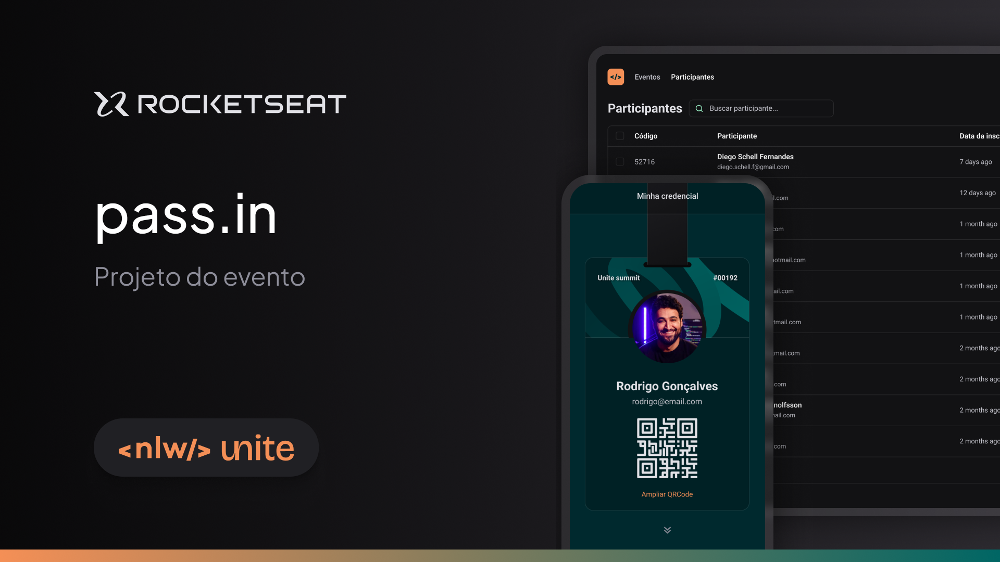

# pass.in

Projeto desenvolvido durante o NLW Unite da [Rocketseat](https://app.rocketseat.com.br/) que consiste em uma aplicação de gestão de participantes em eventos presenciais.



## Índice

- [Ferramentas](#ferramentas)
- [Instalação](#instalação)
- [Funcionalidade](#funcionalidades)
- [Projeto](#projeto)
- [Layout](#layout)
- [Licença](#licença)

## Ferramentas

- **React**: ^18.2.0
- **React DOM**: ^18.2.0
- **React Router DOM**: ^6.26.1
- **Tailwind CSS**: ^3.4.3
- **Zod**: ^3.23.8
- **Day.js**: ^1.11.10
- **Dotenv**: ^16.4.5
- **Lucide React**: ^0.364.0

## Instalação

Siga as etapas abaixo para configurar e instalar o pass.in em seu ambiente local:

1. Clone o repositório e acesse o diretório:

```bash
git clone git@github.com:brunohnsouza/nlw-unite-react.git
cd nlw-unite-react
```

2. Instale as dependências do projeto:

```bash
npm install
```

3. Inicie o servidor em modo de desenvolvimento:

```bash
npm run dev
```

Acesse http://localhost:5173 para visualizar a aplicação.

## Funcionalidades

O projeto oferece as seguintes funcionalidades:

- Cadastrar participantes em um evento;
- Visualizar a lista de participantes;
- Realizar check-in em um evento por meio de um QRCode;

## Vídeos de Testes

Veja os vídeos demonstrando os testes do front-end com o [back-end](https://github.com/brunohnsouza/nlw-unite-node) funcionando localmente em `http://localhost:3333`:

### Página inicial

https://github.com/user-attachments/assets/125f038c-0907-474b-adaf-2d5604f91164

### Página `GetTicket` e `Ticket`

https://github.com/user-attachments/assets/67c06e36-559d-4c1e-8565-86cbacee7c33

## Layout

[Figma](https://www.figma.com/community/file/1356738933008624188/pass-in)

## Licença

[MIT](https://choosealicense.com/licenses/mit/)
